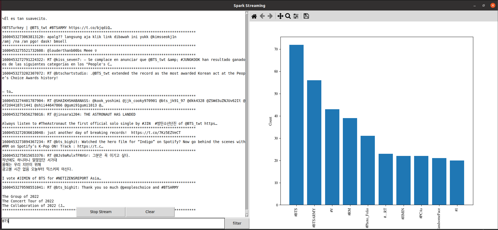
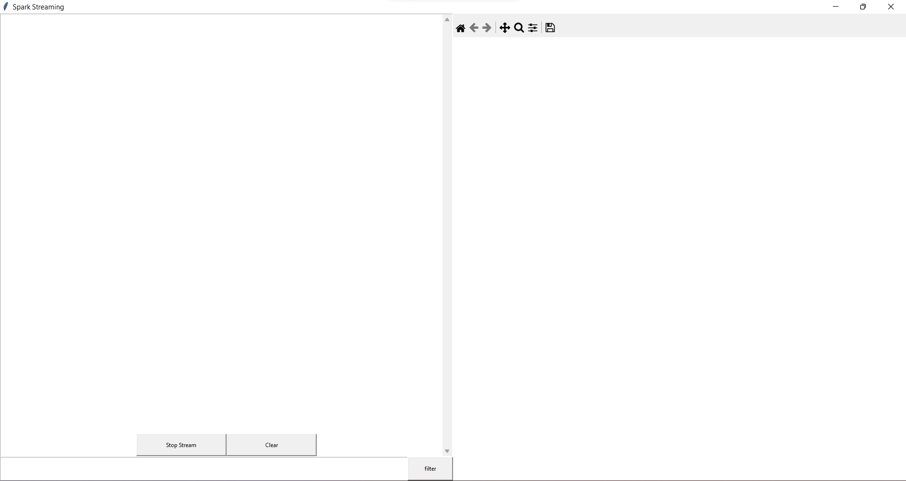

## Ứng dụng Spark Streaming vào việc phân tích dữ liệu từ Twitter

## Introduction
- Ứng dụng tìm kiếm các Tweets theo thời gian thực, phân tích, thao tác trên tập dữ liệu đó.
## Installation

 - Prerequisites:
    - Có thể cài đặt Apache Spark thông qua link sau: [link](https://www.tutorialspoint.com/apache_spark/apache_spark_installation.htm) 
    - Lấy Twitter Developer Key thông qua [link](https://developer.twitter.com/en)

## Screenshots

## DEMO

## Documentation
- Các tài liệu liên quan:
   -[Twitter API](https://developer.twitter.com/en/docs/twitter-api)
   -[Spark API link 1](https://spark.apache.org/docs/latest/streaming-programming-guide.html)
   -[Spark API link 2](https://spark.apache.org/docs/latest/structured-streaming-programming-guide.html)

   

